# Technicolor TC7200.U

## Abstract

The Technicolor TC7200.U is used as a cable modem by UPC / Cablecom in Switzerland. At the moment, UPC Switzerland is slowly replacing the modem for a newer one. 

This document describes 

- Analysis and findings
- How to get root access in the linux console 
- How to access a hidden webservice with a browser

Starting the device and connect an UTP cable directy to the router gives access to the main web based system info and settings screen.

|   |  |
|---|---|
|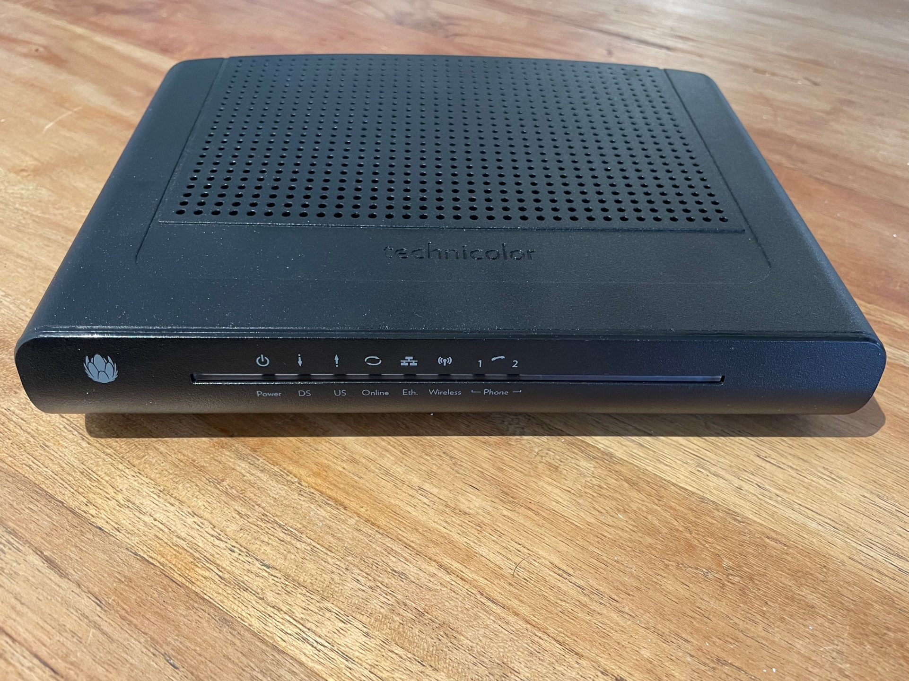|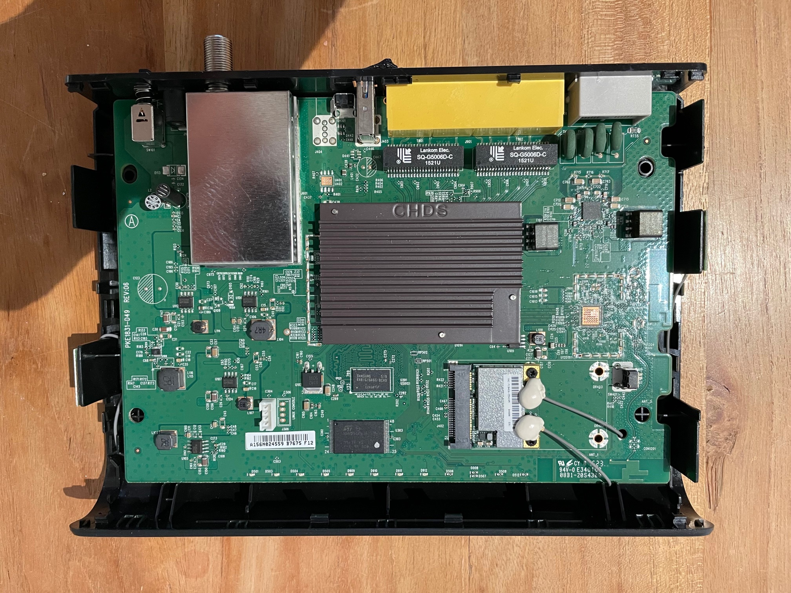|
| Technicolor TC7200.U|Main board|
| 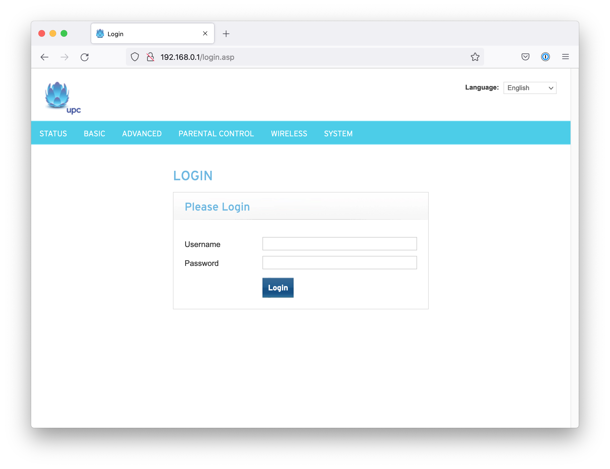 ||
| Web interface login |Web interface home screen|

Let's open the device and look what is inside...


## Boot loader console

On the lower left corner of the main board, there is a socket, marked J305 and a 4 pins row, J306, marked as Linux console. First we measure the pins in the connector. With help of the multimeter and a the oscilloscope, we can determine the label of the pins. 

|Pin 1|Pin 2|Pin 3|Pin 4|
|--|--|--|--|
|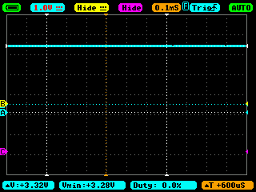|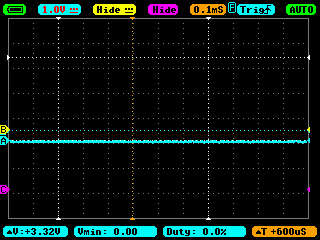|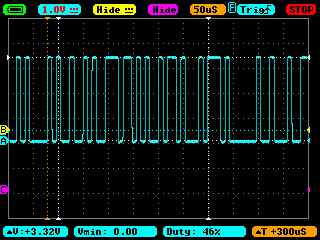|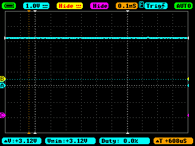|
|VCC|GND|TX|RX|

| Pin | Value | Multimeter | Oscilloscope                      |Bus Pirate|Generic FT232RL board|
| ---- | ----- | ---------- | --------------------------------- |---| ---- |
| 1    | VCC | 3.28V     | 3.28V steady                     |Not connected |Not connected|
| 2    | GND   | 0V         | 0V steady                         |GND |GND|
| 3    | Tx    | 3.12V    | Square wave signal during startup |MISO|Rx|
| 4    | Rx    | 3.12V     | 3.12V steady                     |MOSI|Tx|

Connect the Bus Pirate to the diagnostics port and start a terminal application. E.g:

```sh
$ screen /dev/ttyUSB0 115200 8N1
```


| Bus Pirate connected to the boot loader console |Soldered wires to the linux console|
|--|--|
|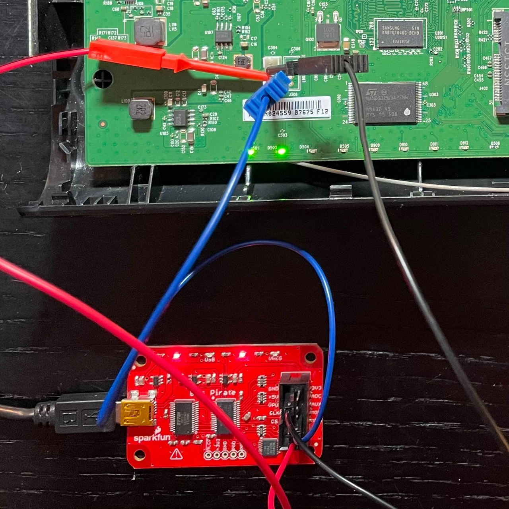|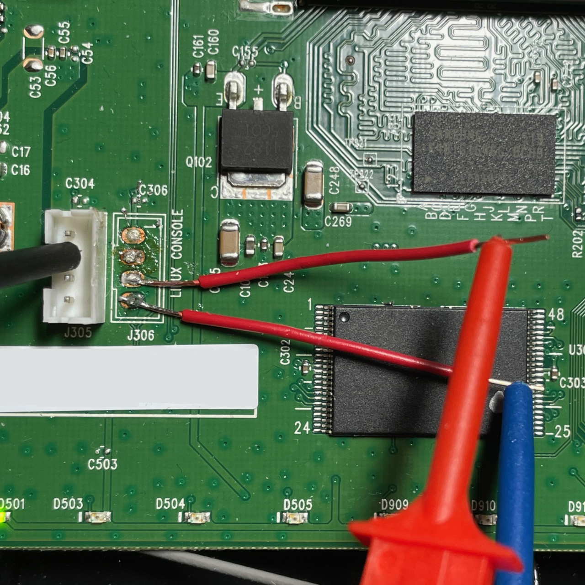|


## Linux Console

The Linux console has test points only on the board. After soldering some wires, we can connect the Bus Pirate to the pins. The soldering was not so easy. It looks like the manufacturer is using some high temperature solder stuff. Only TX and RX have to be soldered. For GND the pin of the boot console can be used. The Linux console (test points only) have the same pin layout as the eCos boot loader console:

| Pin | Value | Multimeter | Oscilloscope                      |Bus Pirate|Generic FT232RL board|
| ---- | ----- | ---------- | --------------------------------- |---| ---- |
| 1    | VCC | 3.28V     | 3.28V steady                     |Not connected |Not connected|
| 2    | GND   | 0V         | 0V steady                         |GND |GND|
| 3    | Tx    | 3.12V    | Square wave signal during startup |MISO|Rx|
| 4    | Rx    | 3.12V     | 3.12V steady                     |MOSI|Tx|

Connect with `screen`, like with the boot loader console. The router is running on:

**Linux version 2.6.30-1.0.10mp1 (wtchen@localhost.localdomain) (gcc version 4.2.3) #1 Mon Feb 24 14:21:58 CST 2014**


### Root access

To get a root shell was extremely simple, just guessing the obvious... Wait for the boot process to finish, then press: `ctrl-j` to get the login prompt and log in with user `root` and password `admin`:

```sh
(none) login: root
Password:


BusyBox v1.19.3 (2014-02-24 14:22:35 CST) built-in shell (ash)
Enter 'help' for a list of built-in commands.

~ # whoami
root
```


### CPU info

```sh
~ # cat /proc/cpuinfo
system type             : BCM93383 reference design
processor               : 0
cpu model               : Broadcom4350 V8.0
BogoMIPS                : 634.88
wait instruction        : yes
microsecond timers      : yes
tlb_entries             : 32
extra interrupt vector  : yes
hardware watchpoint     : no
ASEs implemented        :
shadow register sets    : 1
core                    : 0
VCED exceptions         : not available
VCEI exceptions         : not available
```


### Flash memory and Partitions

The Linux boot shows the following partitions and its flash memory addresses:

```sh
[    0.386000] Flash device 0:  Nor 4 partitions bs: 00010000 ps: 00000100
[    0.392000] 4 partitions
[    0.394000] mtd   offset     size name
[    0.398000]   0 00000000 00010000 bootloader
[    0.402000]   1 00010000 00010000 permnv
[    0.406000]   2 000e0000 00020000 dynnv
[    0.409000]   3 00000000 00100000 Global Fla
[    0.413000] Flash device 1: Nand 6 partitions bs: 00004000 ps: 00000200
[    0.420000] 6 partitions
[    0.422000] mtd   offset     size name
[    0.426000]   0 019c0000 006c0000 image1
[    0.430000]   1 02080000 006c0000 image2
[    0.467000]   2 02744000 0047c000 linux
[    0.470000]   3 00004000 019bc000 linuxapps
[    0.474000]   4 03dc4000 0023c000 dhtml
[    0.478000]   5 02bc4000 011fc000 linuxkfs
[    0.482000] Creating 4 MTD partitions on "bcmmtd_vflash_device":
[    0.487000] 0x000000000000-0x000000010000 : "bootloader"
[    0.494000] 0x000000010000-0x000000020000 : "permnv"
[    0.499000] 0x0000000e0000-0x000000100000 : "dynnv"
[    0.504000] 0x000000000000-0x000000100000 : "Global Fla"
[    0.510000] Creating 6 MTD partitions on "bcmmtd_vflash_device":
[    0.516000] 0x0000019c0000-0x000002080000 : "image1"
[    0.535000] 0x000002080000-0x000002740000 : "image2"
[    0.553000] 0x000002744000-0x000002bc0000 : "linux"
[    0.568000] 0x000000004000-0x0000019c0000 : "linuxapps"
[    0.625000] 0x000003dc4000-0x000004000000 : "dhtml"
[    0.634000] 0x000002bc4000-0x000003dc0000 : "linuxkfs"
```

We can see 10 partitions when asking in the shell:

```sh
~ # cat /proc/partitions
major minor  #blocks  name

  31        0         64 mtdblock0
  31        1         64 mtdblock1
  31        2        128 mtdblock2
  31        3       1024 mtdblock3
  31        4       6912 mtdblock4
  31        5       6912 mtdblock5
  31        6       4592 mtdblock6
  31        7      26352 mtdblock7
  31        8       2288 mtdblock8
  31        9      18416 mtdblock9
```

Matching partition name with the image gives:

| Flash | Type | Partition name | Image name | hex size | block size | Major / minor |
| ----- | ---- | -------------- | ---------- | -------: | ---------: | ------------: |
| 1     | NOR  | mtdblock0      | bootloader | 00010000 |         64 |        31 / 0 |
| 1     | NOR  | mtdblock1      | permnv     | 00010000 |         64 |        31 / 1 |
| 1     | NOR  | mtdblock2      | dynnv      | 00020000 |        128 |        31 / 2 |
| 1     | NOR  | mtdblock3      | Global Fla | 00100000 |       1024 |        31 / 3 |
| 2     | NAND | mtdblock4      | image1     | 006c0000 |       6912 |        31 / 4 |
| 2     | NAND | mtdblock5      | image2     | 006c0000 |       6912 |        31 / 5 |
| 2     | NAND | mtdblock6      | linux      | 0047c000 |       4592 |        31 / 6 |
| 2     | NAND | mtdblock7      | linuxapps  | 019bc000 |      26352 |        31 / 7 |
| 2     | NAND | Mtdblock8      | dhtml      | 0023c000 |       2288 |        31 / 8 |
| 2     | NAND | Mtdblock9      | linuxkfs   | 011fc000 |      18416 |        31 / 9 |

```sh
~ # df -a
Filesystem           1024-blocks    Used Available Use% Mounted on
rootfs                   12728     11920       808  94% /
ubi0:rootfs              12728     11920       808  94% /
proc                         0         0         0   0% /proc
tmpfs                    16384        36     16348   0% /var
tmpfs                       16         0        16   0% /mnt
sysfs                        0         0         0   0% /sys
tmpfs                        4         0         4   0% /root
ubi1:linuxapps           18372       300     18072   2% /apps
```


### Processes

Running processes after succesful boot:

```sh
~ # ps w
  PID USER       VSZ STAT COMMAND
    1 root      1412 S    init
    2 root         0 SW<  [kthreadd]
    3 root         0 SW   [sirq-high/0]
    4 root         0 SW   [sirq-timer/0]
    5 root         0 SW   [sirq-net-tx/0]
    6 root         0 SW   [sirq-net-rx/0]
    7 root         0 SW   [sirq-block/0]
    8 root         0 SW   [sirq-tasklet/0]
    9 root         0 SW   [sirq-sched/0]
   10 root         0 SW   [sirq-<NULL>/0]
   11 root         0 SW   [sirq-rcu/0]
   12 root         0 SW<  [watchdog/0]
   13 root         0 SW<  [events/0]
   14 root         0 SW<  [khelper]
   17 root         0 SW<  [async/mgr]
   70 root         0 SW<  [kblockd/0]
   80 root         0 SW<  [khubd]
   98 root         0 SW   [khungtaskd]
   99 root         0 SW   [pdflush]
  100 root         0 SW   [pdflush]
  101 root         0 SWN  [kswapd0]
  102 root         0 SW<  [nfsiod]
  104 root         0 SW<  [crypto/0]
  123 root         0 SW<  [scsi_tgtd/0]
  130 root         0 SW<  [mtdblockd]
  131 root         0 SW<  [ITCInit]
  132 root         0 SW<  [ITCLinux]
  133 root         0 SW<  [ITCFlash]
  134 root         0 SW<  [ITCCon]
  170 root         0 SW<  [ubi_bgt0d]
  173 root         0 SW<  [ubi_bgt1d]
  197 root         0 SW<  [CheckSysFiles]
  201 root         0 SW<  [rpciod/0]
  266 root      1408 S    syslogd -s 100 -b 0
  280 root         0 SW<  [ubifs_bgt1_0]
  282 root       732 S    lxginit
  307 root      1408 S    udhcpc -b -t 10 -i eth0 -p /var/run/udhcpc.pid -s /etc/dhcp/dhcpc.script
  310 root      1416 S    {gwrepair} /bin/sh /etc/gwrepair 5
  326 root      1408 S    /usr/local/sbin/httpd -h /usr/local/srv/www
  342 root      1412 S    {getty-start} /bin/sh /sbin/getty-start 0 ttyS0
  344 root       672 S    smbapp
  345 root      1416 S    -sh
  402 root       584 S    /bin/mscapp
  477 root      1404 S    sleep 5
  479 root      1412 R    ps w
```


## Backdoor

The list of processes shows that the router is running another web server, pointing to `/usr/local/src/www`. When inspecting the file system, one can see a webservice that is most likely used during development, but never removed before shipping the devices. This is still active on devices. Let's take a look there...

```sh
/apps/usr/local/srv/www/cgi-bin # ls -la
drwxr-xr-x    3 root     root           824 Feb 24  2014 .
drwxr-xr-x    4 root     root           360 Feb 24  2014 ..
drwxr-xr-x    2 root     root           360 Feb 24  2014 CVS
-rwxr-xr-x    1 root     root            74 Feb 24  2014 default-gw.sh
-rwxr-xr-x    1 root     root           209 Jan  1  1970 get-apps-version.cgi
-rwxr-xr-x    1 root     root           482 Feb 24  2014 get-logs.cgi
-rwxr-xr-x    1 root     root           323 Jan  1  1970 index.cgi
-rwxr-xr-x    1 root     root           356 Feb 24  2014 lsmounts.cgi
-rwxr-xr-x    1 root     root           416 Feb 24  2014 service-status.sh
-rwxr-xr-x    1 root     root          3729 Feb 24  2014 settings-post.cgi
-rwxr-xr-x    1 root     root          3281 Feb 24  2014 settings.cgi

```

However, the default routing address of the device is 192.168.0.1, leading to the UPC setup page. When typing e.g. the url http://192.168.0.1/cgi-bin/get-logs.cgi, the browser shows an error page. So how can we access the other web server?

Let's examin the network config:

```sh
~ # ifconfig
eth0      Link encap:Ethernet  HWaddr 00:10:95:DE:AD:07
          inet addr:169.254.179.33  Bcast:169.254.255.255  Mask:255.255.0.0
          inet6 addr: fe80::210:95ff:fede:ad07/64 Scope:Link
          UP BROADCAST RUNNING MULTICAST  MTU:1500  Metric:1
          RX packets:765 errors:0 dropped:0 overruns:0 frame:0
          TX packets:846 errors:0 dropped:0 overruns:0 carrier:0
          collisions:0 txqueuelen:1000
          RX bytes:119724 (116.9 KiB)  TX bytes:178809 (174.6 KiB)

lo        Link encap:Local Loopback
          inet addr:127.0.0.1  Mask:255.0.0.0
          inet6 addr: ::1/128 Scope:Host
          UP LOOPBACK RUNNING  MTU:16436  Metric:1
          RX packets:54 errors:0 dropped:0 overruns:0 frame:0
          TX packets:54 errors:0 dropped:0 overruns:0 carrier:0
          collisions:0 txqueuelen:0
          RX bytes:4536 (4.4 KiB)  TX bytes:4536 (4.4 KiB)
```

This shows a local network address, as if the modem would be not connected to the internet. When we open a browser and type in this ip address, followed by one of the cgi files.... Bingo! We have access to the syslog, kernel log, and some settings without typing any security to prevent it.

|                                              |                                                          |
| -------------------------------------------- | -------------------------------------------------------- |
| 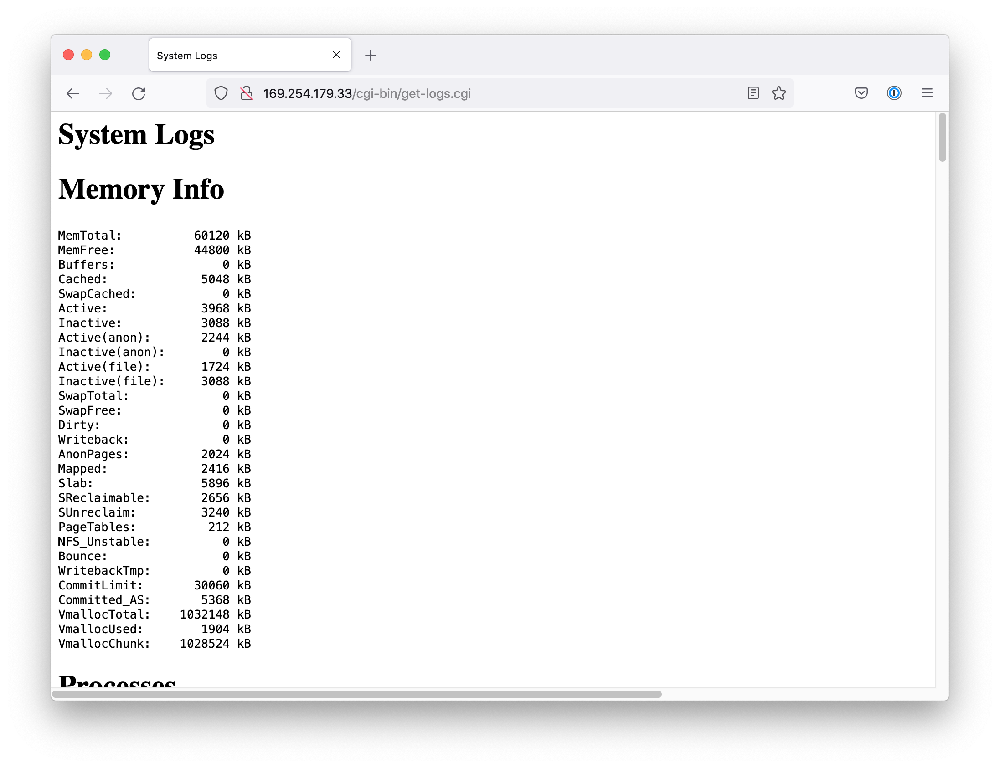    | 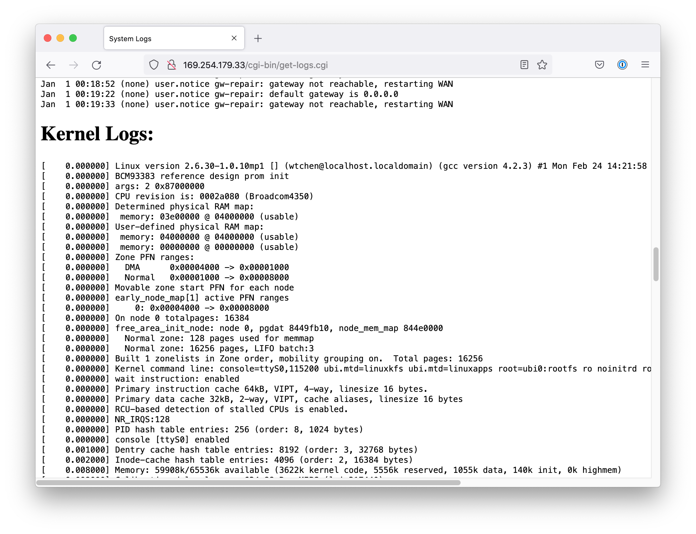                |
| http://169.254.179.33/cgi-bin/get-logs.cgi   | http://169.254.179.33/cgi-bin/get-logs.cgi               |
| 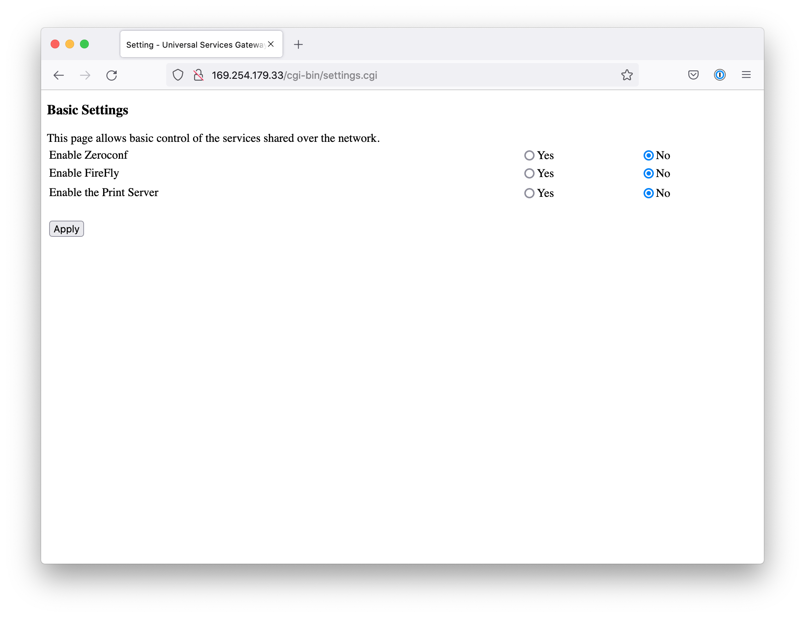 | 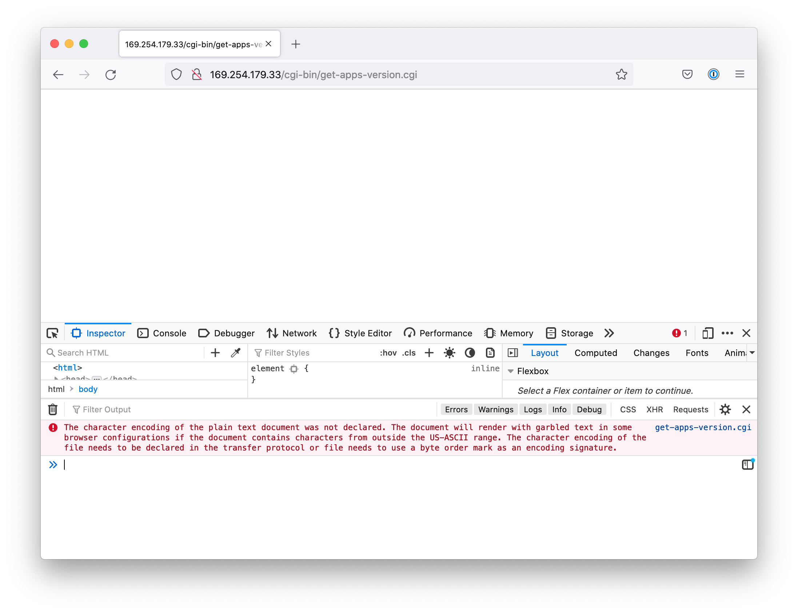 |
| http://169.254.179.33/cgi-bin/settings.cgi   | http://169.254.179.33/cgi-bin/get-apps-version.cgi       |

The `get-apps-version.cgi` returns non valid html. But looking into the script, it should return:

```sh
~ # cat apps/version.txt
/home/wtchen/Project/Cow/targets/93383LxGTP1Nand/LNX1010mp1.LxG3383TP1-apps-140224.bin
一 2月 24 14:28:53 CST 2014
root@localhost.localdomain
gcc version 4.2.3
Version: 1.0.10mp1
```

## 


## References

[eCos Operating System](http://ecos.sourceware.org)

[The eCos Hardware Abstraction Layer (HAL)](http://ecos.sourceware.org/ecos/docs-1.3.1/ref/ecos-ref.b.html)


------


## Appendix

### Bootloader output

```
eCos - hal_diag_init
Init device '/dev/BrcmTelnetIoDriver'
Init device '/dev/ttydiag'
Init tty channel: 817a9bf8
Init device '/dev/tty0'
Init tty channel: 817a9c18
Init device '/dev/haldiag'
HAL/diag SERIAL init
Init device '/dev/ser0'
BCM 33XX SERIAL init - dev: b4e00500.2
Set output buffer - buf: 0x8191c0b0 len: 4096
Set input buffer - buf: 0x8191d0b0 len: 4096
BCM 33XX SERIAL config
Init device '/dev/ser1'
BCM 33XX SERIAL init - dev: b4e00520.3
Set output buffer - buf: 0x8191e0b0 len: 4096
Set input buffer - buf: 0x8191f0b0 len: 4096
BCM 33XX SERIAL config

InitBoard: MIPS frequency 637200000
Function: SetHardcodeVendorProfile
[00:00:00 01/01/1970] [tStartup] BcmBfcStdEmbeddedTarget::InitStorageDrivers:  (BFC Target) Configuring/Loading Flash driver...
[00:00:00 01/01/1970] [tStartup] BcmSpiFlashDevice::DetectFlash:  (SPI Flash Device Factory) WARNING - Detected SPI flash with JEDEC ID =0xc22014
Waited 12 iterations after device ID read
NAND flash: Device size 64 MB, Block size 16 KB, Page size 512 B
[00:00:00 01/01/1970] [tStartup] BcmNandFlashDevice::DetectNandFlash:  (NAND Flash Device Factory) WARNING - Detected NAND flash with JEDEC ID =0x20762076
Found bootloader flash map at 0x80000904.
[00:00:00 01/01/1970] [tStartup] FlashDeviceDriver::SpiFlashPlaceRegions:  (Flash Driver C API) WARNING - Partition falls out of range of device 0. Placing in device 1...
[00:00:00 01/01/1970] [tStartup] FlashDeviceDriver::SpiFlashPlaceRegions:  (Flash Driver C API) WARNING - Partition falls out of range of device 0. Placing in device 1...
[00:00:00 01/01/1970] [tStartup] FlashDeviceDriver::SpiFlashPlaceRegions:  (Flash Driver C API) WARNING - Partition falls out of range of device 0. Placing in device 1...
[00:00:00 01/01/1970] [tStartup] FlashDeviceDriver::SpiFlashPlaceRegions:  (Flash Driver C API) WARNING - Partition falls out of range of device 0. Placing in device 1...
[00:00:00 01/01/1970] [tStartup] FlashDeviceDriver::SpiFlashPlaceRegions:  (Flash Driver C API) WARNING - Partition falls out of range of device 0. Placing in device 1...
[00:00:00 01/01/1970] [tStartup] FlashDeviceDriver::SpiFlashPlaceRegions:  (Flash Driver C API) WARNING - Partition falls out of range of device 0. Placing in device 1...
[00:00:00 01/01/1970] [tStartup] BcmBfcStdEmbeddedTarget::InitStorageDrivers:  (BFC Target) Loading BootloaderStore driver...
[00:00:00 01/01/1970] [tStartup] BcmBfcStdEmbeddedTarget::InitStorageDrivers:  (BFC Target) Loading ProgramStore driver...
ProgramStoreDeviceDriver::ProgramStoreDriverInit:  INFO - Initializing...
[00:00:00 01/01/1970] [tStartup] BcmBfcStdEmbeddedTarget::InitStorageDrivers:  (BFC Target) Loading NonVol driver...
[00:00:00 01/01/1970] [tStartup] BcmBfcStdEmbeddedTarget::InitStorageDrivers:  (BFC Target) Storage drivers initialized successfully.
[00:00:00 01/01/1970] [tStartup] BcmBfcStdEmbeddedTarget::InitDeviceAbstractions:  (BFC Target) Creating singletons for ProgramStore/BootloaderStore/NonVol devices...
Detecting the next image number that we will store to by default...
Bootloader indicates we are running image 2
By default, we will dload to image number 1!

By default, we will dload to block number 0!

[00:00:00 01/01/1970] [tStartup] BcmBfcStdEmbeddedTarget::InitDeviceAbstractions:  (BFC Target) Device abstraction singletons created successfully.

[Askey Debug]: No VP-24, use the default valus
ThomWiFi80211NonVolSettings::GetSingletonInstance:  WARNING - the singleton instance is NULL, and someone is accessing it!
CmSnmpNonVolSettings::GetSingletonInstance:  WARNING - the singleton instance is NULL, and someone is accessing it!
ThomWiFi80211NonVolSettings::GetSingletonInstance:  WARNING - the singleton instance is NULL, and someone is accessing it!
CmSnmpNonVolSettings::GetSingletonInstance:  WARNING - the singleton instance is NULL, and someone is accessing it!
ThomWiFi80211NonVolSettings::GetSingletonInstance:  WARNING - the singleton instance is NULL, and someone is accessing it!
CmSnmpNonVolSettings::GetSingletonInstance:  WARNING - the singleton instance is NULL, and someone is accessing it!
ThomWiFi80211NonVolSettings::GetSingletonInstance:  WARNING - the singleton instance is NULL, and someone is accessing it!
CmSnmpNonVolSettings::GetSingletonInstance:  WARNING - the singleton instance is NULL, and someone is accessing it!
ThomWiFi80211NonVolSettings::GetSingletonInstance:  WARNING - the singleton instance is NULL, and someone is accessing it!
CmSnmpNonVolSettings::GetSingletonInstance:  WARNING - the singleton instance is NULL, and someone is accessing it!
ThomWiFi80211NonVolSettings::GetSingletonInstance:  WARNING - the singleton instance is NULL, and someone is accessing it!
CmSnmpNonVolSettings::GetSingletonInstance:  WARNING - the singleton instance is NULL, and someone is accessing it!
ThomWiFi80211NonVolSettings::GetSingletonInstance:  WARNING - the singleton instance is NULL, and someone is accessing it!
CmSnmpNonVolSettings::GetSingletonInstance:  WARNING - the singleton instance is NULL, and someone is accessing it!
ThomWiFi80211NonVolSettings::GetSingletonInstance:  WARNING - the singleton instance is NULL, and someone is accessing it!
CmSnmpNonVolSettings::GetSingletonInstance:  WARNING - the singleton instance is NULL, and someone is accessing it!
[00:00:00 01/01/1970] [tStartup] BcmCmBpiNonVolSettings::BcmCmBpiNonVolSettings:  (Euro-Docsis CM BPI NonVol Settings) WARNING - Singleton pointer is not NULL!  There are multiple instances!  Leaving the singleton pointer alone...
ThomWiFi80211NonVolSettings::GetSingletonInstance:  WARNING - the singleton instance is NULL, and someone is accessing it!
ThomWiFi80211NonVolSettings::GetSingletonInstance:  WARNING - the singleton instance is NULL, and someone is accessing it!
ThomWiFi80211NonVolSettings::GetSingletonInstance:  WARNING - the singleton instance is NULL, and someone is accessing it!
ThomWiFi80211NonVolSettings::GetSingletonInstance:  WARNING - the singleton instance is NULL, and someone is accessing it!
BcmPcpClientServiceAppIf::GetSingletonInstance:  WARNING - the singleton is NULL, and someone is accessing it!
BcmeRouterNonVolSettings::GetSingletonInstance:  WARNING - the singleton instance is NULL, and someone is accessing it!
mtaNvCalcChecksum: checksum= 1273036263
Reading Permanent settings from non-vol...
Checksum for permanent settings:  0x47cb0bfc
Setting downstream calibration signature to '5.5.10mp1|die temperature:74.108degC'
Setting downstream calibration signature to '5.5.10mp1|die temperature:74.664degC'
[00:00:00 01/01/1970] [tStartup] BcmEmtaSipNonVolSettings::ReadFromImpl:  (EMTA Config NonVol Settings) ERROR - Read unsupported version (less than 1.0)!  These settings are not valid!
[00:00:00 01/01/1970] [tStartup] BcmEmtaSipNonVolSettings::ReadFrom:  (EMTA Config NonVol Settings) ERROR - EMTA Config NonVol Settings failed to read all of its settings from the buffer!
[00:00:00 01/01
[Askey Debug]: GPIO-36: 0
[Askey Debug]: GPIO-37: 1
[Askey Debug]: USG front-end
/1970] [tStartup] BcmBfcAppCompositeNonVolSettings::ReadFrom:  ERROR - A contained Settings object failed to parse the Group settings!
[00:00:00 01/01/1970] [tStartup] BcmEmtaSipNonVolSettings::IsDefault:  (EMTA Config NonVol Settings) Permanent settings are default!

*
*
* One or more of the settings groups was missing, possibly as a result of a code upgrade.
*
*
Settings were read and verified.


Reading Dynamic settings from non-vol...
Checksum for dynamic settings:  0x95818546
BcmPcpClientServiceAppIf::GetSingletonInstance:  WARNING - the singleton is NULL, and someone is accessing it!
Settings were read and verified.

[Askey Debug]: UPC NonVol IsUpgraded=0, Native version=6, Previous=0
[Askey Debug]: No need to rework UPC NonVol country/language code.
[00:00:00 01/01/1970] [tStartup] BcmBfcFpmDriver::Init:  Setting FPM Buffer size to: 256 Base Address: 0x836dd000
[00:00:00 01/01/1970] [tStartup] BcmBfcFpmDriver::Init:  fFpmLargestBufferSize: 2048 fFpmSizeShiftBits: 0x8
[00:00:00 01/01/1970] [tStartup] BcmBfcFpmDriver::Init:  Pool index: 0  pool size: 2048
[00:00:00 01/01/1970] [tStartup] BcmBfcFpmDriver::Init:  Pool index: 1  pool size: 1024
[00:00:00 01/01/1970] [tStartup] BcmBfcFpmDriver::Init:  Pool index: 2  pool size: 512
[00:00:00 01/01/1970] [tStartup] BcmBfcFpmDriver::Init:  Pool index: 3  pool size: 256
[00:00:00 01/01/1970] [tStartup] BcmBfcFpmDriver::Init:  Lookup table index: 0  pool size: 3
[00:00:00 01/01/1970] [tStartup] BcmBfcFpmDriver::Init:  Lookup table index: 1  pool size: 2
[00:00:00 01/01/1970] [tStartup] BcmBfcFpmDriver::Init:  Lookup table index: 2  pool size: 1
[00:00:00 01/01/1970] [tStartup] BcmBfcFpmDriver::Init:  Lookup table index: 3  pool size: 1
[00:00:00 01/01/1970] [tStartup] BcmBfcFpmDriver::Init:  Lookup table index: 4  pool size: 0
[00:00:00 01/01/1970] [tStartup] BcmBfcFpmDriver::Init:  Lookup table index: 5  pool size: 0
[00:00:00 01/01/1970] [tStartup] BcmBfcFpmDriver::Init:  Lookup table index: 6  pool size: 0
[00:00:01 01/01/1970] [tStartup] BcmBfcFpmDriver::Init:  Lookup table index: 7  pool size: 0

------------------------------------
Free Pool Manager Configuration
------------------------------------
Buffer size in Bytes............... 256
Number of Tokens................... 32768
Single buffer tokens used count.... 32
Double buffer tokens used ocunt.... 32
Triple buffer tokens used count.... 32
Quadruple buffer tokens used count. 33
Base Address of FPM Memory ........ 0xb2200200
Base Address of FPM Mem in DDR2.... 0x836dd000
Total Configured FPM Memory Size... 8388608
Free Fifo Full..................... 0
Free Fifo Empty.................... 1
Alloc Fifo Full.................... 1
Alloc Fifo Empty................... 0
Number of tokens available......... 32768
Number of not valid token frees.... 0
Number of not valid token multi.... 0
Overflow Count..................... 0
Underflow Count.................... 0
[00:00:01 01/01/1970] [tStartup] BcmBfcPacketAlloc::Init:  Packet Alloc Header Buffer Start Addr: 0x82fdcf20 Length: 0x700000 Max Buffer Size: 0xe0
PCI Core Init!  instance = 0, pCoreRegs = b2800000
PCI Core PowerUp!  instance = 0.
PCI Core Init Instance (0): No Link Status Found! Skipping enumeration.
PCI Core Power Down. Instance = 0!
PCI Core Init!  instance = 1, pCoreRegs = b2a00000
PCI Core PowerUp!  instance = 1.

PCI ENUMERATE*****************************************************************Creating a new host MSG PROC DQM manager. Instance: 83f405f4, DQM_REGS = b8601800, CTRL_REGS = b8601000
Initializing main MSP DQM interrupts.
 b8601000: 01800008
 b8601004: 00000000
 b8601008: 00000008
 b860100c: 00000000
 b8601010: 000c0000
 b8601014: 00000000
 b8601018: 00000000
 b860101c: 00000000
***********
Checking bus #1
Creating a new host FAP DQM manager. Instance: 83f40520
Initializing main FAP DQM interrupts.
 b8401000: 00000008
 b8401004: 00000000
 b8401008: 00000008
 b840100c: 00000000
 b8401010: 00000000
 b8401014: 00000000
 b8401018: 00000000
 b840101c: 00000000
        Checking device #0
                In pcieEnumerateDevicCreating a new host PMC DQM manager. Instance: 83efd758, DQM_REGS = b8801800, CTRL_REGS = b8801000
Initializing main PMC DQM interrupts.
 b8801000: 00000000
 b8801004: 00000000
 b8801008: 00000008
 b880100c: 00000000
 b8801010: 00000000
 b8801014: 00000004
 b8801018: a1c9c380
 b880101c: 00f79fb0
Creating a new host PMC DQM manager. Instance: 83efd6c0, DQM_REGS = b8801800, CTRL_REGS = b8801000
es(1) found a card: deviceNo = 0, funcNo = 0, busNo = 1, pcieAddr = 83fbcb68
                In pcieEnumerateDevices: vendor = 000014e4, device = 00004359
END PCIE ENUMERATE************************************************************************

Booting Linux on TP1...
BootLinux() TP1
NandFlashRead: Detected out-of-order block @offset 0x28b0000, tagged offset 0xffffff00, expected offset 0x170000
NandFlashRead: Failed to find replacement block!
BootLinux: stopping the intermediate AVS code...
<<<<< rx_thread sent initial handshake >>>>>>
BootLinux: intermediate AVS code stopped normally (count = 2)
Powering on USB
Linux Boot Args: console=ttyS0,115200 ubi.mtd=linuxkfs ubi.mtd=linuxapps root=ubi0:rootfs ro noinitrd rootfstype=ubifs mem=67108864@67108864 mem=0@0
[00:00:02 01/01/1970] [Telnet Thread] BcmTelnetThread::ThreadMain:  (Telnet Thread) Telnet server thread running...
Creating SNMP agent cablemodem agent
cablemodem agent disabling management.
cablemodem agent defering traps.
Creating BcmEmtaCommandTable
Creating BcmEmtaEndptCommandTable

If you pressed the 's' key before this point, we will skip driver initialization...
AVS Thread Constructor....
AVS Thread InitAVS: Bootloader AVS data was retrieved successfully.
   xfer         = 0x817ee728
   disabled     = 0
   rmon ratio   = 1065
   sigma        = -224
   DacChange    = 21
   adc_margin   = 150
   madcperdac   = 285
   dac_margin   = -476
   flash margin = 150
   marginOffset = 65534
   deviceMap    = 0x817ee740
   thresholds   = 0x817ee7dc
   K = 1.065, L = 2.6, BG_Code = 5

Creating TR-069 Thread...
Creating DOCSIS Control Thread...
Initializing main DTP DQM interrupts.
 b8201000: 0000004c
 b8201004: 00000000
 b8201008: 00000008
 b820100c: 00000000
 b8201010: 00000000
 b8201014: 00040000
 b8201018: 00000000
 b820101c: 00000000
Creating a new host FAP DQM manager. Instance: 82f4a2b8
Creating a new host FAP DQM manager. Instance: 82f4a1d0
Creating a new host UTP DQM manager. Instance: 82f460b8
Initializing main UTP DQM interrupts.
 b8001000: 00000049
 b8001004: 00000000
 b8001008: 00000008
 b800100c: 00000000
 b8001010: 00000001
 b8001014: 00000000
 b8001018: 00000000
 b800101c: 00000000
Initalizing Gfap Hal..
LNA Detected = Internal
RF_freq is 440000000 so set REFPLL_LO to 1
RF_freq is 440000000 so set REFPLL_LO to 1
RF_freq is 440000000 so set REFPLL_LO to 1
ADC Clocks aligned
Initializing all 8 downstreams - this takes a while.  Patience, Grasshopper...
1 2 3 4 5 6 7 8
Creating a new host UTP DQM manager. Instance: 82f103b8
Creating a new host UTP DQM manager. Instance: 82efffc8
Creating a new host UTP DQM manager. Instance: 82efff00
Powering UP switch. PIN = 14
Creating a new host MSG PROC DQM manager. Instance: 82eff69c, DQM_REGS = b8601800, CTRL_REGS = b8601000
Creating a new host MSG PROC DQM manager. Instance: 82eff5d4, DQM_REGS = b8601800, CTRL_REGS = b8601000
Creating a new host MSG PROC DQM manager. Instance: 82eff430, DQM_REGS = b8601800, CTRL_REGS = b8601000
Creating a new host MSG PROC DQM manager. Instance: 82eff230, DQM_REGS = b8601800, CTRL_REGS = b8601000
Creating a new host FAP DQM manager. Instance: 82eff030
Creating a new host FAP DQM manager. Instance: 82efee28
Creating a new host MPEG PROC DQM manager. Instance: 82efec20, DQM_REGS = b8a01800, CTRL_REGS = b8a01000
Initializing main MEP DQM interrupts.
 b8a01000: 00000008
 b8a01004: 00000000
 b8a01008: 00000008
 b8a0100c: 00000000
 b8a01010: 00000000
 b8a01014: 00000000
 b8a01018: 00000000
 b8a0101c: 00000000
Creating a new host MPEG PROC DQM manager. Instance: 82efea28, DQM_REGS = b8a01800, CTRL_REGS = b8a01000
Creating a new host MSG PROC DQM manager. Instance: 82ee98ac, DQM_REGS = b8601800, CTRL_REGS = b8601000
Creating a new host MSG PROC DQM manager. Instance: 82ee96a4, DQM_REGS = b8601800, CTRL_REGS = b8601000
Creating a new host MSG PROC DQM manager. Instance: 82ee974c, DQM_REGS = b8601800, CTRL_REGS = b8601000
Creating a new host MSG PROC DQM manager. Instance: 82ee7748, DQM_REGS = b8601800, CTRL_REGS = b8601000
Creating a new host MSG PROC DQM manager. Instance: 82ee76bc, DQM_REGS = b8601800, CTRL_REGS = b8601000
Register Int Handler: busNo = 1, device = 0
Creating a new host MPEG PROC DQM manager. Instance: 82b5ef7c, DQM_REGS = b8a01800, CTRL_REGS = b8a01000
Creating a new host MPEG PROC DQM manager. Instance: 829f22d4, DQM_REGS = b8a01800, CTRL_REGS = b8a01000
Creating a new host MPEG PROC DQM manager. Instance: 829f2224, DQM_REGS = b8a01800, CTRL_REGS = b8a01000
Creating a new host MSG PROC DQM manager. Instance: 828b0a8c, DQM_REGS = b8601800, CTRL_REGS = b8601000
Checking plant power...
Plant power is 5.881848.  Turning amp on since that is below the threshold

<cut>
```

### Linux Console output

```
Linux version 2.6.30-1.0.10mp1 [] (wtchen@localhost.localdomain) (gcc version 4.2.3) #1 Mon Feb 24 14:21:58 CST 2014
[    0.000000] BCM93383 reference design prom init
[    0.000000] args: 2 0x87000000
[    0.000000] CPU revision is: 0002a080 (Broadcom4350)
[    0.000000] Determined physical RAM map:
[    0.000000]  memory: 03e00000 @ 04000000 (usable)
[    0.000000] User-defined physical RAM map:
[    0.000000]  memory: 04000000 @ 04000000 (usable)
[    0.000000]  memory: 00000000 @ 00000000 (usable)
[    0.000000] Zone PFN ranges:
[    0.000000]   DMA      0x00004000 -> 0x00001000
[    0.000000]   Normal   0x00001000 -> 0x00008000
[    0.000000] Movable zone start PFN for each node
[    0.000000] early_node_map[1] active PFN ranges
[    0.000000]     0: 0x00004000 -> 0x00008000
[    0.000000] On node 0 totalpages: 16384
[    0.000000] free_area_init_node: node 0, pgdat 8449fb10, node_mem_map 844e0000
[    0.000000]   Normal zone: 128 pages used for memmap
[    0.000000]   Normal zone: 16256 pages, LIFO batch:3
[    0.000000] Built 1 zonelists in Zone order, mobility grouping on.  Total pages: 16256
[    0.000000] Kernel command line: console=ttyS0,115200 ubi.mtd=linuxkfs ubi.mtd=linuxapps root=ubi0:rootfs ro noinitrd rootfstype=ubifs mem=67108864@67108864 mem=0@0
[    0.000000] wait instruction: enabled
[    0.000000] Primary instruction cache 64kB, VIPT, 4-way, linesize 16 bytes.
[    0.000000] Primary data cache 32kB, 2-way, VIPT, cache aliases, linesize 16 bytes
[    0.000000] RCU-based detection of stalled CPUs is enabled.
[    0.000000] NR_IRQS:128
[    0.000000] PID hash table entries: 256 (order: 8, 1024 bytes)
[    0.000000] console [ttyS0] enabled
[    0.001000] Dentry cache hash table entries: 8192 (order: 3, 32768 bytes)
[    0.002000] Inode-cache hash table entries: 4096 (order: 2, 16384 bytes)
[    0.008000] Memory: 59908k/65536k available (3622k kernel code, 5556k reserved, 1055k data, 140k init, 0k highmem)
[    0.009000] Calibrating delay loop... 634.88 BogoMIPS (lpj=317440)
[    0.031000] Mount-cache hash table entries: 512
[    0.035000] net_namespace: 748 bytes
[    0.036000] NET: Registered protocol family 16
[    0.038000] Added platform devs for chip ID = 0x338300a2!
[    0.046000] bio: create slab <bio-0> at 0
[    0.048000] SCSI subsystem initialized
[    0.049000] usbcore: registered new interface driver usbfs
[    0.050000] usbcore: registered new interface driver hub
[    0.051000] usbcore: registered new device driver usb
[    0.052000] NET: Registered protocol family 8
[    0.053000] NET: Registered protocol family 20
[    0.056000] NET: Registered protocol family 2
[    0.060000] IP route cache hash table entries: 1024 (order: 0, 4096 bytes)
[    0.068000] TCP established hash table entries: 2048 (order: 2, 16384 bytes)
[    0.074000] TCP bind hash table entries: 2048 (order: 1, 8192 bytes)
[    0.081000] TCP: Hash tables configured (established 2048 bind 2048)
[    0.087000] TCP reno registered
[    0.090000] NET: Registered protocol family 1
[    0.097000] squashfs: version 4.0 (2009/01/31) Phillip Lougher
[    0.102000] squashfs: version 4.0 with LZMA457 ported by BRCM
[    0.109000] NTFS driver 2.1.29 [Flags: R/W].
[    0.115000] JFFS2 version 2.2. (NAND) © 2001-2006 Red Hat, Inc.
[    0.127000] fuse init (API version 7.11)
[    0.131000] msgmni has been set to 117
[    0.135000] alg: No test for cipher_null (cipher_null-generic)
[    0.140000] alg: No test for ecb(cipher_null) (ecb-cipher_null)
[    0.146000] alg: No test for digest_null (digest_null-generic)
[    0.151000] alg: No test for compress_null (compress_null-generic)
[    0.162000] alg: No test for stdrng (krng)
[    0.166000] io scheduler noop registered (default)
[    0.173000] PPP generic driver version 2.4.2
[    0.177000] NET: Registered protocol family 24
[    0.184000] <<<<<<<<< rpc_init >>>>>>>>>
[    0.188000] rpc_register_functions registered service 0: 1 functions
[    0.194000] rpc_init send handshake message
[    0.198000] bcm9338x_mtd driver v1.0
[    0.201000] <<<<<<<<< rpc_init >>>>>>>>>
[    0.205000] Benign Warning: Redundant rpc_init()
[    0.209000] cpu_idle CPU 0
[    0.362000] <<<<< dqm_init_func beef0002 >>>>>
[    0.366000] RPC Version 00000003
[    0.369000] DQM Init complete for dqm tunnel 0
[    0.374000] <<<<< dqm_init_func beef0001 >>>>>
[    0.386000] Flash device 0:  Nor 4 partitions bs: 00010000 ps: 00000100
[    0.392000] 4 partitions
[    0.394000] mtd   offset     size name
[    0.398000]   0 00000000 00010000 bootloader
[    0.402000]   1 00010000 00010000 permnv
[    0.406000]   2 000e0000 00020000 dynnv
[    0.409000]   3 00000000 00100000 Global Fla
[    0.413000] Flash device 1: Nand 6 partitions bs: 00004000 ps: 00000200
[    0.420000] 6 partitions
[    0.422000] mtd   offset     size name
[    0.426000]   0 019c0000 006c0000 image1
[    0.430000]   1 02080000 006c0000 image2
[    0.467000]   2 02744000 0047c000 linux
[    0.470000]   3 00004000 019bc000 linuxapps
[    0.474000]   4 03dc4000 0023c000 dhtml
[    0.478000]   5 02bc4000 011fc000 linuxkfs
[    0.482000] Creating 4 MTD partitions on "bcmmtd_vflash_device":
[    0.487000] 0x000000000000-0x000000010000 : "bootloader"
[    0.494000] 0x000000010000-0x000000020000 : "permnv"
[    0.499000] 0x0000000e0000-0x000000100000 : "dynnv"
[    0.504000] 0x000000000000-0x000000100000 : "Global Fla"
[    0.510000] Creating 6 MTD partitions on "bcmmtd_vflash_device":
[    0.516000] 0x0000019c0000-0x000002080000 : "image1"
[    0.535000] 0x000002080000-0x000002740000 : "image2"
[    0.553000] 0x000002744000-0x000002bc0000 : "linux"
[    0.568000] 0x000000004000-0x0000019c0000 : "linuxapps"
[    0.625000] 0x000003dc4000-0x000004000000 : "dhtml"
[    0.634000] 0x000002bc4000-0x000003dc0000 : "linuxkfs"
[    0.675000] bcm9338x Linux services init
[    0.679000] rpc_register_functions registered service 1: 8 functions
[    0.685000] bcm9338x send Linux version
[    0.689000] UBI: attaching mtd9 to ubi0
[    0.693000] UBI: physical eraseblock size:   16384 bytes (16 KiB)
[    0.699000] UBI: logical eraseblock size:    15360 bytes
[    0.704000] UBI: smallest flash I/O unit:    512
[    0.708000] UBI: VID header offset:          512 (aligned 512)
[    0.714000] UBI: data offset:                1024
[    6.774000] UBI: attached mtd9 to ubi0
[    6.778000] UBI: MTD device name:            "linuxkfs"
[    6.783000] UBI: MTD device size:            17 MiB
[    6.787000] UBI: number of good PEBs:        1150
[    6.792000] UBI: number of bad PEBs:         1
[    6.796000] UBI: max. allowed volumes:       89
[    6.800000] UBI: wear-leveling threshold:    4096
[    6.805000] UBI: number of internal volumes: 1
[    6.809000] UBI: number of user volumes:     1
[    6.813000] UBI: available PEBs:             0
[    6.818000] UBI: total number of reserved PEBs: 1150
[    6.822000] UBI: number of PEBs reserved for bad PEB handling: 11
[    6.828000] UBI: max/mean erase counter: 1/0
[    6.832000] UBI: attaching mtd7 to ubi1
[    6.836000] UBI: physical eraseblock size:   16384 bytes (16 KiB)
[    6.842000] UBI: logical eraseblock size:    15360 bytes
[    6.847000] UBI: smallest flash I/O unit:    512
[    6.851000] UBI: VID header offset:          512 (aligned 512)
[    6.857000] UBI: data offset:                1024
[    6.861000] UBI: background thread "ubi_bgt0d" started, PID 170
[   17.698000] UBI: attached mtd7 to ubi1
[   17.702000] UBI: MTD device name:            "linuxapps"
[   17.707000] UBI: MTD device size:            25 MiB
[   17.712000] UBI: number of good PEBs:        1647
[   17.716000] UBI: number of bad PEBs:         0
[   17.720000] UBI: max. allowed volumes:       89
[   17.725000] UBI: wear-leveling threshold:    4096
[   17.729000] UBI: number of internal volumes: 1
[   17.733000] UBI: number of user volumes:     1
[   17.738000] UBI: available PEBs:             0
[   17.742000] UBI: total number of reserved PEBs: 1647
[   17.747000] UBI: number of PEBs reserved for bad PEB handling: 16
[   17.752000] UBI: max/mean erase counter: 2/1
[   17.757000] UBI: background thread "ubi_bgt1d" started, PID 173
[   17.763000] usbcore: registered new interface driver usblp
[   17.768000] usbcore: registered new interface driver libusual
[   17.774000] usbcore: registered new interface driver usbserial
[   17.780000] USB Serial support registered for generic
[   17.785000] usbcore: registered new interface driver usbserial_generic
[   17.791000] usbserial: USB Serial Driver core
[   17.796000] USB Serial support registered for cp2101
[   17.800000] usbcore: registered new interface driver cp2101
[   17.806000] cp210x: v0.08:Silicon Labs CP2101/CP2102 RS232 serial adaptor driver
[   17.813000] USB Serial support registered for pl2303
[   17.818000] usbcore: registered new interface driver pl2303
[   17.823000] pl2303: Prolific PL2303 USB to serial adaptor driver
[   17.829000] Serial: BCM63XX driver $Revision: 1.8 $
[   17.834000] ttyS0 at MMIO 0xb4e00520 (irq = 11) is a BCM63XX
[   17.839000] fFpmLargestBufferSize: 2048  fFpmSizeShiftBits: 0x8
[   17.845000] Pool index: 0  pool size: 2048
[   17.849000] Pool index: 1  pool size: 1024
[   17.853000] Pool index: 2  pool size: 512
[   17.856000] Pool index: 3  pool size: 256
[   17.860000] Lookup table index: 0  pool size: 3
[   17.865000] Lookup table index: 1  pool size: 2
[   17.869000] Lookup table index: 2  pool size: 1
[   17.873000] Lookup table index: 3  pool size: 1
[   17.877000] Lookup table index: 4  pool size: 0
[   17.882000] Lookup table index: 5  pool size: 0
[   17.886000] Lookup table index: 6  pool size: 0
[   17.890000] Lookup table index: 7  pool size: 0
[   17.895000] bcmvenet: bcmvenet_probe
[   17.899000] Broadcom BCM3383(A2) Ethernet Network Device v0.1 Feb 24 2014 14:20:40
[   17.907000] bcmvenet_probe getting mac address
[   17.912000] eth0: MAC Address: 00:10:95:DE:AD:07
[   17.916000] ehci_hcd: USB 2.0 'Enhanced' Host Controller (EHCI) Driver
[   17.922000] EHCI-brcm EHCI-brcm.0: Broadcom STB EHCI
[   17.928000] EHCI-brcm EHCI-brcm.0: new USB bus registered, assigned bus number 1
[   17.966000] EHCI-brcm EHCI-brcm.0: irq 32, io mem 0x12e00000
[   17.977000] EHCI-brcm EHCI-brcm.0: USB 0.0 started, EHCI 1.00
[   17.982000] usb usb1: configuration #1 chosen from 1 choice
[   17.988000] hub 1-0:1.0: USB hub found
[   17.992000] hub 1-0:1.0: 2 ports detected
[   17.996000] Default to set USB power on.
[   18.000000] USB LED driver loaded. LED number 4 selected.
[   18.006000] rpc_user_init: registered device class brpc
[   18.011000] Mirror/redirect action on
[   18.014000] u32 classifier
[   18.017000]     input device check on
[   18.021000]     Actions configured
[   18.025000] TCP cubic registered
[   18.028000] Initializing XFRM netlink socket
[   18.032000] NET: Registered protocol family 10
[   18.043000] IPv6 over IPv4 tunneling driver
[   18.050000] NET: Registered protocol family 17
[   18.054000] NET: Registered protocol family 15
[   18.058000] error while creating igmp_snooping proc
[   18.063000] Initializing MCPD Module
[   18.067000] RPC: Registered udp transport module.
[   18.071000] RPC: Registered tcp transport module.
[   18.076000] 802.1Q VLAN Support v1.8 Ben Greear <greearb@candelatech.com>
[   18.082000] All bugs added by David S. Miller <davem@redhat.com>
[   18.119000] UBIFS: mounted UBI device 0, volume 0, name "rootfs"
[   18.125000] UBIFS: mounted read-only
[   18.128000] UBIFS: file system size:   17141760 bytes (16740 KiB, 16 MiB, 1116 LEBs)
[   18.136000] UBIFS: journal size:       4085760 bytes (3990 KiB, 3 MiB, 266 LEBs)
[   18.143000] UBIFS: media format:       w4/r0 (latest is w4/r0)
[   18.148000] UBIFS: default compressor: lzo
[   18.152000] UBIFS: reserved for root:  0 bytes (0 KiB)
[   18.179000] VFS: Mounted root (ubifs filesystem) readonly on device 254:1.
[   18.186000] Freeing unused kernel memory: 140k freed
[   19.908000] rpc_send_request timeouts 1 total timeouts 1 clean 9782
init started: BusyBox v1.19.3 (2014-02-24 14:22:35 CST)
starting pid 205, tty '': '/etc/init.d/rcS'

rcS: Loading drivers and kernel modules...

[   20.701000] Driver 'sd' needs updating - please use bus_type methods
[   20.837000] Initializing USB Mass Storage driver...
[   20.851000] usbcore: registered new interface driver usb-storage
[   20.856000] USB Mass Storage support registered.
[   21.026000] dspdd: module license 'Proprietary' taints kernel.
[   21.031000] Disabling lock debugging due to kernel taint
[   21.048000] TP0main: c028d000
Starting syslogd
rcS: Mounting apps partition
[   21.226000] UBIFS: recovery needed
[   21.245000] UBIFS: recovery completed
[   21.248000] UBIFS: mounted UBI device 1, volume 0, name "linuxapps"
[   21.254000] UBIFS: file system size:   24698880 bytes (24120 KiB, 23 MiB, 1608 LEBs)
[   21.262000] UBIFS: journal size:       4085760 bytes (3990 KiB, 3 MiB, 266 LEBs)
[   21.269000] UBIFS: media format:       w4/r0 (latest is w4/r0)
[   21.274000] UBIFS: default compressor: lzo
[   21.278000] UBIFS: reserved for root:  0 bytes (0 KiB)
rcS: Starting lxginit
rcS: Starting udhcpc
[   21.354000] Sending link up message to app.
[   21.366000] Link is up
udhcpc: udhcpc (v1.19.3) started

udhcpc: Sending discover...

udhcpc: Sending discover...

udhcpc: Sending discover...

udhcpc: Sending discover...

[   31.483000] eth0: no IPv6 routers present
udhcpc: Sending discover...

udhcpc: Sending discover...

udhcpc: Sending discover...

udhcpc: Sending discover...

udhcpc: Sending discover...

udhcpc: Sending discover...

udhcpc: No lease, forking to background

rcS: Starting gwrepair
rcS: Stoping telnetd service
rcS: Droping all ICMP echo......
/home/wtchen/Project/Cow/targets/93383LxGTP1Nand/LNX1010mp1.LxG3383TP1-apps-140224.bin
一 2月 24 14:28:53 CST 2014
root@localhost.localdomain
gcc version 4.2.3
Version: 1.0.10mp1

Starting httpd: [  OK  ]
rcS: Starting getty on ttyS0
starting pid 342, tty '': 'smbapp '
NAS: Network Attached Storage Control Application [Version 1.3 Build Feb 24 2014 14:27:30]
found 0 USB devices
NAS: Will retry bind in 15 seconds
Launching mscapp
SmbApp: waiting on port 49182 to recvfrom...
MSC: Media Server Control Application [Version 1.2 Build Feb 24 2014 14:27:30]
MSC: waiting for data on port UDP 49181
SmbApp: Got a command before initialization, replying with UNINITIALIZED
SmbApp: Cmd SendConfig feature 0053
SmbApp: Nas Enable
SmbApp: launch_smbd
found 0 USB devices
SmbApp: lanuched smbd at pid 401
SmbApp: Netbios Enable
SmbApp: launch_nmbd
SmbApp: lanuched nmbd at pid 459
SmbApp: ApprovedAll Enabled
SmbApp: ApprovedOnly Disabled
SmbApp: DefaultShareAll Enable
Adding share
share_name:    storage
share_path:    /mnt/hd  share_flags:   0x3
set netbios name TC7200-DMS
set workgroup name WORKGROUP
set admin name admin
set admin pass
smbapp: Deleted user admin.
Added user admin.
smbapp: Killing nmbd (pid 459)
umounting all USB devices
smbapp: Killing smbd (pid 401)
SmbApp: executeCmdNasEnable featureBitfield 0053
SmbApp: launch_smbd
pid 401 terminated normally
pid 459 terminated normally
found 0 USB devices
SmbApp: lanuched smbd at pid 466
SmbApp: launch_nmbd
SmbApp: lanuched nmbd at pid 524
SmbApp: Cmd SendConfig feature 0053
SmbApp: No Feature change
SmbApp: Cmd SendConfig feature 0053
SmbApp: No Feature change
SmbApp: Cmd SendConfig feature 0053
SmbApp: No Feature change
SmbApp: Cmd SendConfig feature 0053
SmbApp: No Feature change
gw-repair: default gateway is 0.0.0.0
gw-repair: gateway not reachable, restarting WAN
gw-repair: default gateway is 0.0.0.0
gw-repair: gateway not reachable, restarting WAN
Disable USB host power succeeded.
gw-repair: default gateway is 0.0.0.0
gw-repair: gateway not reachable, restarting WAN
gw-repair: default gateway is 0.0.0.0
gw-repair: gateway not reachable, restarting WAN
gw-repair: default gateway is 0.0.0.0
gw-repair: gateway not reachable, restarting WAN
gw-repair: default gateway is 0.0.0.0
gw-repair: gateway not reachable, restarting WAN
gw-repair: default gateway is 0.0.0.0
gw-repair: gateway not reachable, restarting WAN
gw-repair: default gateway is 0.0.0.0
gw-repair: gateway not reachable, restarting WAN
gw-repair: default gateway is 0.0.0.0
gw-repair: gateway not reachable, restarting WAN
gw-repair: default gateway is 0.0.0.0
gw-repair: gateway not reachable, restarting WAN


<cut>
```


```

```