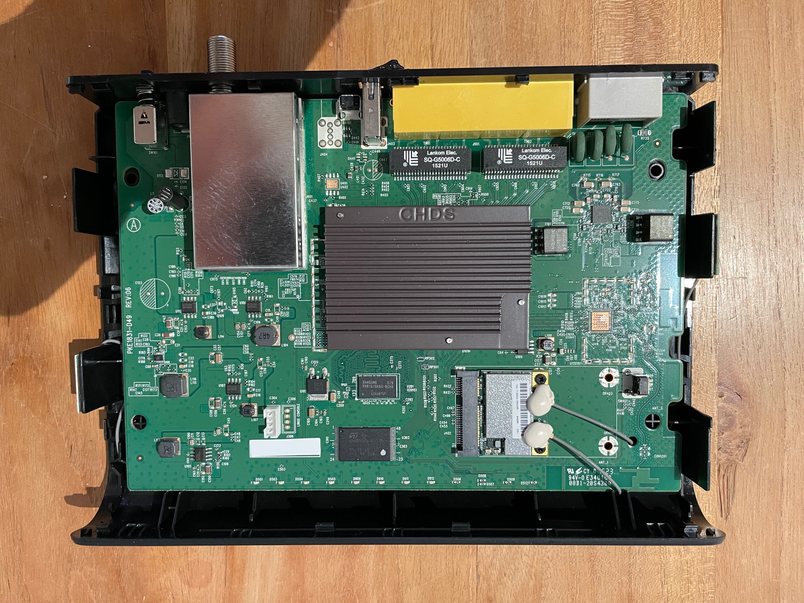

# Technicolor TC7200.U

## Abstract

The Technicolor TC7200.U is used as a cable modem by UPC / Cablecom in Switzerland. As to my knowledge, this router is not used anymore. 

|   |  |
|---|---|
|||
| Technicolor TC7200.U|Main board|

## Diagnostics port

On the lower left corner, there is a socket, marked J305 and a 4 pins row, J306, marked as Linux console. First we measure the pins in the connector. With help of the multimeter and a the oscilloscope.

| Pin | Value | Multimeter | Oscilloscope                      |Bus Pirate|
| ---- | ----- | ---------- | --------------------------------- |---|
| 1    | 3.3V  | 3.3V       | 3.3V steady                       |Not connected |
| 2    | GND   | 0V         | 0V steady                         |GND |
| 3    | Tx    | 3.28V      | Square wave signal during startup |MISO|
| 4    | Rx    | 3.3V       | 3.3V steady                       |MOSI|

| |
|--|
||
| Output of pin 3 during startup. |


Connect the Bus Pirate to the diagnostics port and start a terminal application. E.g:

```bash
$ screen /dev/ttyUSB0 115200 8N1
```
| |
|--|
||
| Bus Pirate connected to the diagnostics port. |

Then set the bus pirate in Transparent Bridge mode with the following sequence:

```
HiZ>m
1. HiZ
2. 1-WIRE
3. UART
4. I2C
5. SPI
6. 2WIRE
7. 3WIRE
8. LCD
9. DIO
x. exit(without change)

(1)>3
Set serial port speed: (bps)
 1. 300
 2. 1200
 3. 2400
 4. 4800
 5. 9600
 6. 19200
 7. 38400
 8. 57600
 9. 115200
10. BRG raw value

(1)>9
Data bits and parity:
 1. 8, NONE *default
 2. 8, EVEN
 3. 8, ODD
 4. 9, NONE
(1)>1
Stop bits:
 1. 1 *default
 2. 2
(1)>1
Receive polarity:
 1. Idle 1 *default
 2. Idle 0
(1)>1
Select output type:
 1. Open drain (H=Hi-Z, L=GND)
 2. Normal (H=3.3V, L=GND)

(1)>1
Ready
UART>(0)
 0.Macro menu
 1.Transparent bridge
 2. Live monitor
 3.Bridge with flow control
UART>(1)
UART bridge
Reset to exit
Are you sure? y
```


## References

[eCos Operating System](http://ecos.sourceware.org)

[The eCos Hardware Abstraction Layer (HAL)](http://ecos.sourceware.org/ecos/docs-1.3.1/ref/ecos-ref.b.html)


```

```